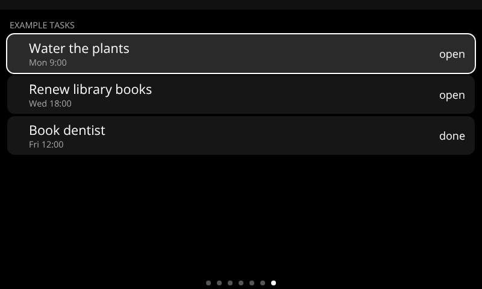
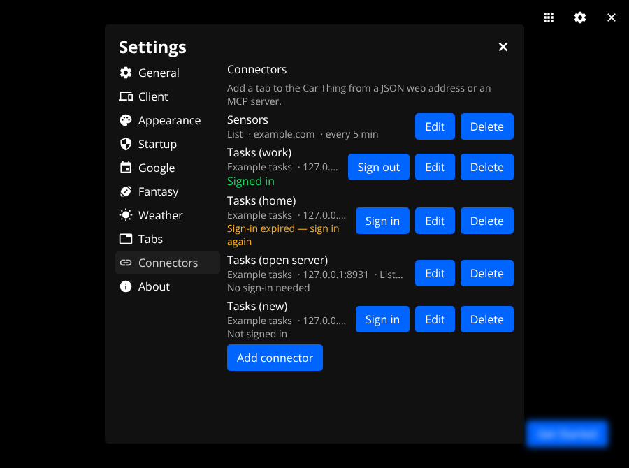
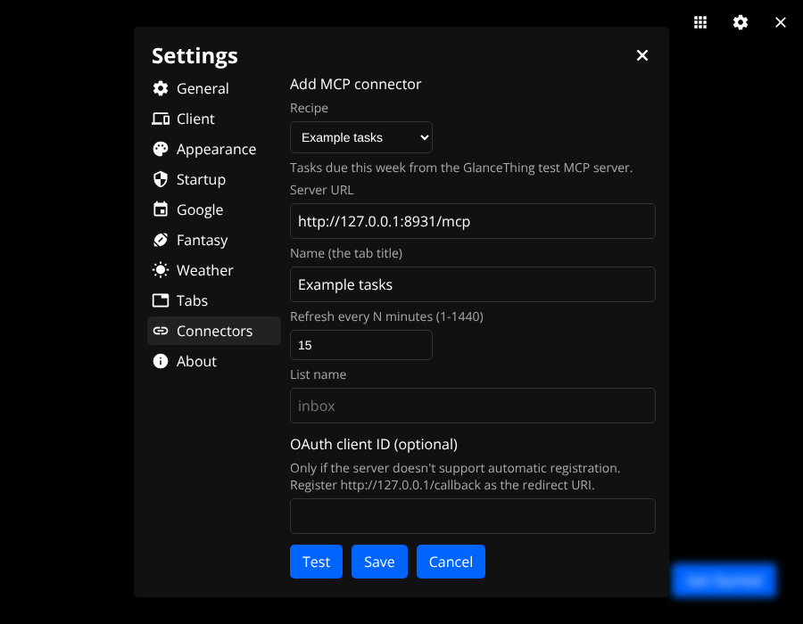
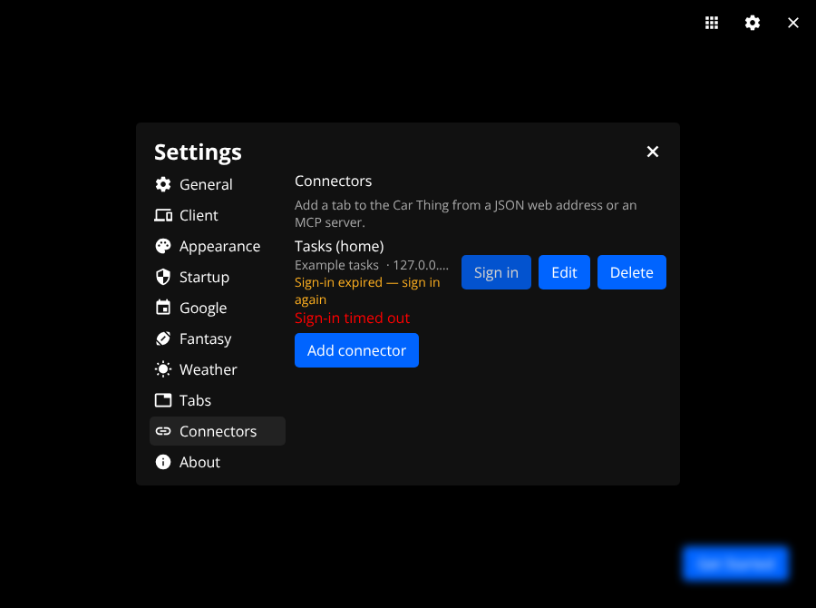

# Adding a tab

The one guide to adding a tab to the Car Thing: pick a path, then follow its section.

## Which path do I use?

| Path | Use it when | What you write | Release needed |
| --- | --- | --- | --- |
| JSON connector | Any HTTPS (or LAN http) JSON API | Nothing; added in Settings | None |
| MCP recipe | An MCP server with a read-only tool or resource | One recipe JSON (made by the `add-connector` workflow), a test and fixtures | Desktop build; no client release |
| Code-built app module | Anything else (custom UI, complex logic, several requests) | Host and client code | Client release |

Prefer the top-most path that fits.

## JSON connectors

Use one when the data is a single URL that returns JSON and a list, big number, key-value rows or grid is enough. It adds a tab with no release.

### Steps

In Settings → Connectors, press Add connector, then:

1. Name: the tab title (at most 24 characters).
2. URL: `http://` or `https://`, no username or password, at most 2000 characters.
3. Refresh every N minutes: 1-1440.
4. Layout: List, Big number, Key-value or Grid.
5. Mapping: the paths for that layout (below).
6. Secret header (optional): header name and value, for an API key or token.
7. Test: fetches the URL and shows the mapped result without saving. Fix any error, then Save. The tab appears on the device at once; show, hide and reorder it in Settings → Tabs.

### Layouts and mapping

- List: items path, primary (at most 80 characters), optional secondary (40) and value (16). Up to 20 rows; more are counted as "+N more".
- Grid: items path, label (40) and value (16). Up to 12 cells.
- Big number: value path, optional caption path, optional unit (literal text, at most 8 characters) and decimals (0-3; default up to 2).
- Key-value: up to 8 rows, each a literal label (at most 40 characters) and the path of its value.

Paths use dots and array indexes: `data.items[0].price`. An empty path means the whole response. For List and Grid, the items path picks an array ("for each item in") and the other paths are relative to each item; leave it empty when the response itself is the array.

### Limits and network rules

- At most 20 connectors. Each request: 10 s, 1 MB, 3 redirects, and the response must have a JSON content type.
- Public hosts must use https. http is allowed only when every address the host name resolves to is local: 10.0.0.0/8, 172.16.0.0/12, 192.168.0.0/16, 127.0.0.0/8, `::1`, fc00::/7 (this includes `.local` names). Link-local addresses are refused. A redirect from https to http is refused.
- Tailscale addresses (100.64.0.0/10) count as public, so use https there.
- The host makes every request; the device only gets display-ready text.

### Secret header

The value is kept in secure storage and is never shown again. When editing, the field shows Set with Replace and Clear. Over http the form warns that the value is sent unencrypted. Changing the URL's host (protocol, host or port) requires entering the value again. The secret is dropped on a redirect to another origin, and a response that contains the secret is rejected.

### Example: Home Assistant

Create a long-lived access token in your Home Assistant user profile. The values below are fake.

Big number, URL `http://homeassistant.local:8123/api/states/sensor.house_power`, header name `Authorization`, value `Bearer <your long-lived token>`:

- Value path `state`, unit `W`, caption path `attributes.friendly_name`.

List, URL `http://homeassistant.local:8123/api/states`, same header:

- Items path empty (the response is an array), primary `attributes.friendly_name`, secondary `entity_id`, value `state`.

### Errors

A failed fetch keeps the last good data and marks the tab stale with a short message (for example "Public hosts must use https"). Messages never contain the URL or the secret. Test shows the same messages before you save.

## MCP recipes

A recipe is a committed JSON file that names one read-only MCP tool (or one resource), the arguments, and how to map the result onto a layout. The host is the MCP client; the device only gets display-ready text. Ids are `mcp:<id>` for the saved connector.



### Using a recipe

1. Settings → Connectors → Add connector → MCP recipe.
2. Pick the recipe. The server URL, name and refresh interval are filled from it; change them if needed. Fill any recipe settings (for example a list name).
3. OAuth client ID (optional): only if the server does not support dynamic client registration. Register `http://127.0.0.1/callback` as the redirect URI with the server, then paste the client ID here. A stored ID shows Replace and Clear.
4. Test (optional) shows the mapped result without saving. Save adds the tab.
5. Sign in, on the connector's row: opens your system browser, listens once on 127.0.0.1 for the callback, and gives up after 5 minutes. Servers that need no login show "No sign-in needed" after the first successful fetch.
6. Show, hide and reorder the tab in Settings → Tabs.




Badges:

- Signed in: a token is stored. Sign out removes it.
- Not signed in: press Sign in.
- Sign-in expired — sign in again: the token expired and could not be refreshed in the background. The tab shows "Signed out or login expired: sign in again in Settings" until you press Sign in.
- No sign-in needed: the server answered without a token.



Sign-in needs OS secure storage (Electron `safeStorage`); without it nothing is saved and the app says "Secure storage unavailable on this system". Tokens, client info and PKCE verifiers live only in secure storage on the desktop and never reach the device. Delete removes the connector and its stored auth. Changing the server's origin clears the old sign-in.

### How it runs

- Every fetch lists the server's tools (`tools/list`, all pages) and refuses unless the recipe's tool has `annotations.readOnlyHint === true`. A missing tool, or a server with more than 1000 tools or 20 pages, is also refused. Only the recipe's one tool (or one resource read) is ever called.
- Result precedence for a tool: an error result fails with "Server error: ..."; `structuredContent` if it is an object; otherwise the text parts joined and parsed as JSON; if that is not JSON, the text is mapped as `{text}`. For a resource: the first content's text, parsed the same way; binary is refused.
- The whole run has a 30 s budget. Errors are short fixed strings with no URL or token.
- Network rules are the same as for JSON connectors: https for public hosts, http only when every address is local, link-local refused, redirects re-checked, 10 s and 1 MB per request. A result that contains a stored token is refused.
- No LLM runs at any point.

### Writing a recipe by hand

Put `src/main/lib/connectors/recipes/<id>.json` in the repo. The file name must match `id`. Unknown keys are rejected everywhere.

| Field | Rule |
| --- | --- |
| `id` | 1-32 characters of `a-z 0-9 -`; equals the file name |
| `label` | 1-24 characters (the default tab title) |
| `description` | 0-200 characters |
| `defaultServerUrl` | optional; a valid connector URL (http or https, no credentials, at most 2000 characters) |
| `intervalMin` | whole number 1-1440 |
| `tool` or `resource` | exactly one of them |
| `tool.name` | 1-128 characters of `A-Za-z0-9_.-/` |
| `tool.args` | optional object; top-level keys may not start with `$`; nesting at most 5 deep; strings at most 1000 characters; numbers finite |
| `resource.uri` | 1-512 characters |
| `settings` | optional list, at most 5 |
| `settings[].key` | letter first, then letters, digits or `_`, 1-32 characters; unique |
| `settings[].label` | 1-40 characters |
| `settings[].placeholder` | optional, 0-100 characters |
| `settings[].maxLength` | optional whole number 1-200 (default 200) |
| `layout` | `list`, `number`, `keyvalue` or `grid` |
| `mapping` | as for JSON connectors (above), checked by the same validator |

Argument values are literals (text, numbers, booleans, null, lists, objects) or one of two computed forms. Nothing else is evaluated; any other `$` key is rejected.

| Form | Result |
| --- | --- |
| `{"$host": "now"}` | current time, ISO with offset: `2026-10-10T14:03:09.120-05:00` |
| `{"$host": "today"}` | local date: `2026-10-10` |
| `{"$host": "dayStart"}` | start of the local day, ISO: `2026-10-10T00:00:00.000-05:00` |
| `{"$host": "dayEnd", "offsetDays": 7}` | end of the local day 7 days on: `2026-10-17T23:59:59.999-05:00` |
| `{"$host": "dayStart", "format": "epochMs"}` | milliseconds since the epoch |
| `{"$host": "now", "format": "date"}` | `2026-10-10` |
| `{"$setting": "list"}` | the text the user typed for setting `list` (empty text if unset) |

`$host` is one of `now`, `today`, `dayStart`, `dayEnd`. `offsetDays` is an integer from -30 to 30 and shifts whole days. `format` is `iso`, `date` or `epochMs`; the default is `date` for `today` and `iso` otherwise. Times use the desktop's time zone. `$setting` must name a declared setting.

The committed example, `src/main/lib/connectors/recipes/example-tasks.json`:

```json
{
  "id": "example-tasks",
  "label": "Example tasks",
  "description": "Tasks due this week from the GlanceThing test MCP server.",
  "defaultServerUrl": "http://127.0.0.1:8931/mcp",
  "intervalMin": 15,
  "tool": {
    "name": "list_tasks",
    "args": {
      "from": { "$host": "dayStart" },
      "to": { "$host": "dayEnd", "offsetDays": 7 },
      "list": { "$setting": "list" }
    }
  },
  "settings": [
    { "key": "list", "label": "List name", "placeholder": "inbox", "maxLength": 40 }
  ],
  "layout": "list",
  "mapping": {
    "itemsPath": "tasks",
    "primary": "title",
    "secondary": "due",
    "value": "status"
  }
}
```

Dropping a valid file in that folder is the only code change; recipes are bundled at build, so it needs a new desktop build but no client release. `src/main/lib/mcp/recipes.test.ts` loads every file there and fails the gate if one is invalid.

Also add a test for the recipe, in the shape the workflow writes (`src/main/lib/mcp/recipes/<id>.test.ts`): parse the recipe with `parseRecipe`; assert its tool has `readOnlyHint === true` in a committed tools-list fixture (`src/main/lib/mcp/fixtures/recipes/<id>.tools-list.json`); run a sanitized sample (`<id>.sample.json`) through `toolResultData` (or `resourceResultData`) and `applyMapping`; assert a non-empty `ConnectorView` within `LIMITS`.

### Running the workflow

The `add-connector` workflow turns a server URL into the recipe, fixtures, test, preview payloads and a screenshot:

```
Workflow({ name: 'add-connector', args: { ... } })
// or Workflow({ scriptPath: '.claude/workflows/add-connector.js', args: { ... } })
```

Args:

- `url` (required): the server URL; becomes `defaultServerUrl` unless `defaultUrl: false`.
- `goal` (required): one line, e.g. "Show my open tasks due this week". Becomes the description.
- `toolsList` (required): a saved `tools/list` result (`{tools:[...]}` or `{result:{tools:[...]}}`), as an object or a file path.
- `sample` (required): a saved tool result or resource read, object or file path.
- `id`: `^[a-z0-9-]{1,32}$`, not already used. Derived from the goal if omitted.
- `tool` or `resource` (not both), `layout`, `mapping`, `toolArgs`: fix the design yourself. With tool/resource, layout and mapping all given, the design phase is skipped.
- `defaultUrl`, `skipScreenshot`, `skipGate`: set `false`/`true` to turn those parts off or on as named.

Phases and model tiers: Inputs (haiku: sanitize both files, list read-only tools), Design (sonnet: tool, layout, mapping, settings), Write (sonnet: recipe, test, preview payloads), Screenshot (haiku), Gate (haiku: `npm run gate -- fast`). The script rechecks `readOnlyHint` itself and refuses a tool that lacks it. If Write fails twice on sonnet it escalates that one call to opus and reports the escalation; list it in the PR body.

It writes: the recipe, `src/main/lib/mcp/fixtures/recipes/<id>.{tools-list,sample}.json`, `src/main/lib/mcp/recipes/<id>.test.ts`, `scripts/preview/payloads/mcp-<8 chars>.json`, `scripts/preview/payloads/tabs.<id>.json`, and `docs/connector-screenshots/<id>.png`.

No live login: no agent ever contacts the MCP server. You capture the inputs yourself while signed in, for example with the MCP Inspector, or with the SDK client (`client.listTools()` and `client.callTool(...)`) in a throwaway script, and save or paste the JSON. Do not paste tokens. The sanitizer replaces values under keys that look like secrets (token, secret, password, authorization, api key, cookie) with `REDACTED` and email addresses with `user@example.com`; it does not catch everything, so read the fixtures before committing.

Helper, usable on its own: `node scripts/mcp-recipe-check.mjs tools <tools-list.json>` (split read-only and refused tools), `tool <tools-list.json> <name>` (exit non-zero unless read-only), `sanitize <in.json> <out.json>`, `id <id>` (checks the id is valid and unused).

After it finishes: review the fixtures, update `AGENTS.md` if anything there became wrong, then commit the recipe, fixtures, test, payloads and screenshot together.

### Testing locally

- `src/main/lib/mcp/testServer/` has a test MCP server (`startTestMcpServer`, tool `list_tasks`, one resource) and a fake OAuth server (`startTestAuthServer`, `authorizeVia`) for vitest. They are for tests only and are not a standalone process. `src/main/lib/mcp/fixtures/` holds the matching `tools-list.json` and `list_tasks.result.json`.
- Preview the tab: `VARIANT_tabs=mcp node scripts/preview/server.mjs &` adds the example tab at index 6 (see `scripts/preview/README.md`).
- Settings screenshots: `node scripts/preview/settings.mjs <state>` with a state from `scripts/preview/settings-states/` (`mcp-list`, `mcp-form`, `mcp-expired`); output goes to `docs/m9c-screenshots/`.

## Code-built app modules

Use this when a connector cannot do the job. A module is one host folder, one client folder and one line in each registry, all with the same id. Ids are lowercase. `json:<id>` and `mcp:<id>` belong to connectors. Never name anything "apps"; `src/main/lib/handlers/apps.ts` is desktop shortcuts.

### Host

1. Put the data source in `src/main/lib/<source>/` with a `fixtures/` folder and tests. Tests use mocked HTTP and committed fixtures, never live calls.
   - The host owns all network calls. The device never sees tokens; store secrets with `setStorageValue(key, value, true)`.
   - The device clock is unreliable, so send preformatted times (labels) in the payload.
2. Add the feed key to the `FeedKey` union in `src/main/lib/feeds/types.ts`. Skip this if the module has no feed.
3. Write the handler in `src/main/lib/modules/<id>/handler.ts`. Copy `src/main/lib/modules/weather/handler.ts`: export `name`, `hasActions`, and `handle`, which calls `respondWithFeed(key, ws)`. Handler names must be unique across all modules. A handler need not serve a feed: `clock/handler.ts` just sends a payload, and `clock/timerHandler.ts` (`timer`) has `actions`. With `hasActions: true`, a plain `{type}` request (no `action`) still reaches `handle`; a request with an `action` goes to the matching entry in `actions`. A module can list several handlers.
4. Write the manifest in `src/main/lib/modules/<id>/index.ts` (see `weather/index.ts`), typed `ModuleManifest` from `src/main/lib/modules/types.ts`:
   - `id`, `label`
   - `feeds()`: returns `FeedSource[]` (`() => []` for a module with no feed, like Spotify and Clock), each with `key`, `fetch`, `interval(items)` (ms), `describeError` (`describeFetchError(e, 'Name')` from `feeds/errors.ts`), and optional `decorate` and `prepare`
   - `feedKeys`: the same keys, in the same order, as `feeds()` returns (`[]` with no feed)
   - `handlers`: `[handler]`
   - `dependsOn`: ids of modules whose feeds must keep running while this one is visible (optional)
   - `settings`: `{ panel }` if the app has a Settings panel (optional). `panel` is the union `'google' | 'fantasy' | 'weather' | 'clock'` in `modules/types.ts`; a new panel needs that union extended and the panel added to `src/renderer/src/pages/Settings/Settings.tsx` (a button and a component, as for Weather and Clock).
5. Add `import { manifest as <id> }` and one entry to `modules` in `src/main/lib/modules/registry.ts`. Array order is the default tab order. Put a new module last (as Clock is) unless there is a reason not to: existing users' saved tab order gets unknown ids appended last by normalization, so a module placed elsewhere shows up in a different position for them than for new users.

### Client

1. Create `client/src/modules/<id>/` with the tab component, `types.ts` (payload types) and `index.tsx`:
   `export const module: ClientModule = { id, label, render: active => <Tab active={active} /> }` (type in `client/src/modules/types.ts`).
2. Fetch data with `useFeed<Item>('<id feed key>', active)` from `client/src/hooks/useFeed.ts`. A module with no feed gets its data its own way (Clock uses `ClockContext`).
3. If it has a feed, add the key to `FeedType` in `client/src/types/Feeds.ts`, and re-export the payload types there.
4. Add one line to `modules` in `client/src/modules/registry.ts`, in the same position as on the host.
5. Input: buttons `1`-`4`, `m` and `Escape` are global (1/2 previous/next tab, 3 Calendar, 4 sleep on the clock, `m` menu, `Escape` player); do not handle them in a tab. A tab that uses the dial (`wheel`) or `Enter` must act only while it is active, the app is not blurred and the player is hidden: read `blurred` and `playerShown` from `AppBlurContext` (`client/src/contexts/AppBlurContext.tsx`), as `ClockTab.tsx` does (`active && !blurred && !playerShown`); `useListNav` does the same for lists.
6. The target is Chrome 69 at 800×480. No flexbox `gap`, `aspect-ratio` or `:is()`. Show host labels, do not format times on the device.

### What you get for free

- A tab picker entry in Settings, with show/hide and reorder, pushed live to the device.
- Polling stops while the tab is hidden, unless a visible module lists it in `dependsOn`.
- A hidden feed is still fetched once on a settings change or a client request.

### Module checklist

- `src/main/lib/modules/registry.test.ts` and `client/src/modules/registry.test.ts`: update the expected id list in both (same order); the other tests check unique handler names, `dependsOn` targets and `feedKeys` against `feeds()`.
- Add tests for the data source and any `view.ts` helpers.
- `npm run gate -- fast`.
- Preview: add `scripts/preview/payloads/<type>.json` (copy another payload, shapes are in `client/src/modules/<id>/types.ts`), then follow `scripts/preview/README.md`. Add the tab to the tab order notes there.
- Update `AGENTS.md` (tab list, module entries, preview notes).

## Checklist for any new tab

- Tests use committed fixtures and mocked HTTP, never live calls.
- A screenshot at 800×480 (`scripts/preview/README.md`).
- `npm run gate -- fast` between steps, `npm run gate` before the PR.
- `AGENTS.md` updated in the same commit (or "AGENTS.md: no update needed" in the PR body).
- Releases: only a code-built module or other client change needs a release. Bump `version` in `package.json` and `client/package.json` (and both lockfiles) to the next `0.0.16-tabs.N` in the milestone PR. After merging, push the tag `v0.0.16-tabs.N` only; never create the release by hand (`build-release.yml` builds it). A release marked as a pre-release is invisible to the in-app update check. JSON connectors and recipes need no client release.
